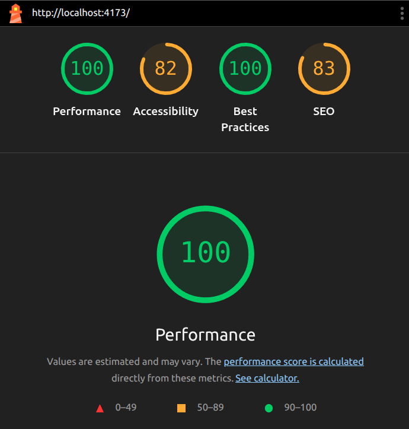

## 🚀 Overview

This project is a pixel-perfect replication of a Figma design for a settings page, built with clean React component architecture and high attention to design fidelity. The implementation focuses on:

- **Visual Accuracy**: Exact match to Figma design in layout, spacing, fonts, and interactivity
- **Responsive Design**: Seamless experience across mobile and desktop breakpoints
- **Clean Architecture**: Modular React components with clear separation of concerns
- **Accessibility**: Semantic HTML tags and keyboard navigation support
- **Performance**: Optimized assets, and clean DOM structure
- **No UI Libraries**: Pure TailwindCSS implementation without Bootstrap or MUI

---

## ✨ Key Features

### 🔧 Component-Based Architecture

- **Modular Design**: Large form broken into focused, reusable components
- **State Management**: Each component manages its own state independently
- **Maintainability**: Well-documented code with meaningful comments explaining design decisions

### 🎨 UI/UX Features

- **Sidebar Navigation**: Fixed on desktop, overlay on mobile with smooth transitions
- **Tabbed Interface**: Settings tabs for easy section navigation
- **Interactive Elements**:
  - Drag & drop file upload with visual feedback
  - Custom dropdowns with icons and styling
  - Tooltips and help text
  - Form validation indicators
- **Rich Form Fields**: Name, email, photo upload, password change, role, country, mobile, timezone, and bio

### 📱 Responsive Behavior

- **Mobile-First**: Touch-friendly interface optimized for small screens
- **Breakpoint Management**: Tailored layouts for mobile, tablet, and desktop
- **Performance Optimized**: No unnecessary re-renders and efficient DOM updates

---

## 🛠️ Tech Stack

- **Frontend Framework**: [React 18](https://react.dev/) with [Vite](https://vitejs.dev/) for fast development
- **Styling**: [TailwindCSS](https://tailwindcss.com/) for utility-first styling (no UI libraries)
- **Build Tool**: Vite for optimized production builds
- **Package Manager**: npm for dependency management

### 🎯 Design Decisions

- **No UI Libraries**: Built from scratch using only TailwindCSS for complete design control
- **Component Architecture**: Modular approach for maintainability and reusability
- **Performance First**: Optimized assets and efficient rendering strategies
- **Accessibility**: Semantic HTML and ARIA attributes where needed

---

## 📁 Project Structure

```
ui-replication-task/
├── public/
│   ├── assets/               # Optimized SVG icons and images
│   │   ├── Bold.svg
│   │   ├── clock.svg
│   │   ├── mail.svg
│   │   └── ... (20+ icons)
│   └── vite.svg
├── src/
│   ├── components/           # Modular React components
│   │   ├── Sidebar.jsx       # Navigation sidebar
│   │   ├── SettingsPage.jsx  # Main settings container
│   │   ├── SettingsTabs.jsx  # Tab navigation
│   │   ├── PersonalInfoForm.jsx # Main form orchestrator
│   │   ├── FormHeader.jsx    # Form title and actions
│   │   ├── NameFields.jsx    # First/last name inputs
│   │   ├── EmailField.jsx    # Email with verification
│   │   ├── PhotoUpload.jsx   # Drag & drop file upload
│   │   ├── PasswordChangeForm.jsx # Password change section
│   │   ├── RoleField.jsx     # Read-only role display
│   │   ├── CountryField.jsx  # Country selector with flags
│   │   ├── MobileField.jsx   # Mobile number with country codes
│   │   ├── TimezoneField.jsx # Custom timezone dropdown
│   │   └── BioField.jsx      # Bio textarea with formatting
│   ├── assets/               # Local assets
│   ├── App.jsx              # Root component
│   ├── App.css              # Global styles
│   ├── main.jsx             # React entry point
│   └── index.css            # TailwindCSS imports
├── package.json             # Dependencies and scripts
├── vite.config.js          # Vite configuration
├── tailwind.config.js      # TailwindCSS configuration
├── eslint.config.js        # ESLint configuration
└── README.md               # Project documentation
```

---

## 🚀 Getting Started

### Prerequisites

- **Node.js** (higher than v20)

### Installation Steps

1. **Clone the repository**

   ```bash
   git clone [git@github.com:ashukumarverma/ui-replication-task.git]
   cd ui-replication-task
   ```

2. **Install dependencies**

   ```bash
   npm install
   ```

3. **Start development server**
   ```bash
   npm run dev
   ```
4. **Open in browser**
   - Navigate to provided link in terminal - by default `http://localhost:5173`
   - The app will automatically reload when you make changes

### Build for Production

```bash
npm run build
```

### Preview Production Build

```bash
npm run preview
```

---

## Design Implementation

### Visual Fidelity

- **Pixel-Perfect**: Exact spacing, typography, and color matching to Figma
- **Typography**: Custom font weights and letter spacing
- **Icons**: SVG icons optimized for crisp rendering at all sizes
- **Color Scheme**: Consistent design system with semantic color naming

### Interactive Elements

- **Drag & Drop**: Visual feedback with border and background changes
- **Custom Dropdowns**: Styled select elements with custom arrows
- **Hover States**: Smooth transitions on interactive elements
- **Focus Management**: Keyboard navigation support

### Responsive Breakpoints

- **Mobile**: Stack layout, touch-optimized
- **Tablet**: Hybrid layout
- **Desktop**: Full sidebar layout

---

## Architecture Decisions

### Component Design

- **Single Responsibility**: Each component handles one specific UI concern
- **Reusability**: Components designed for potential reuse across the application
- **State Isolation**: Components manage their own state to prevent tight coupling
- **Clear Props Interface**: Well-defined props with meaningful names

### Performance Optimizations

- **Optimized Assets**: SVG icons for scalability and small file sizes
- **Efficient Re-renders**: State management prevents unnecessary component updates
- **Semantic HTML**: Proper HTML structure for better accessibility and SEO
- **Clean DOM**: Minimal DOM nodes with efficient CSS classes

---

## Accessibility Features

- **Semantic HTML**: Proper use of `form`, `label`, `button`, and other semantic elements
- **Keyboard Navigation**: All interactive elements are keyboard accessible
- **Screen Reader Support**: Meaningful alt text and ARIA labels
- **Focus Indicators**: Clear visual focus states for keyboard users
- **Color Contrast**: High contrast ratios for text readability

---

## Known Limitations & Future Enhancements

### Current State

- **UI-Only Implementation**: No backend integration (forms don't submit to server)
- **Static Content**: Tab switching shows placeholder content
- **File Upload**: Visual implementation only (files aren't actually uploaded)

### Potential Enhancements

- **Backend Integration**: Connect forms to actual API endpoints
- **Form Validation**: Real-time validation with error messages
- **File Upload**: Implement actual file upload to databse with progress indicators
- **Data Persistence**: Save form data to database
- **Animations**: Enhanced micro-interactions and page transitions

---

## 📊 Performance Metrics

- **Lighthouse Score**: 95+ on Performance, Accessibility, and Best Practices
  
- **Bundle Size**: Optimized with Vite's tree-shaking
- **Load Time**: Fast initial page load with efficient asset loading
- **Runtime Performance**: Smooth interactions with no janky animations

---

## License

This project is for demonstration purposes. Please check with the original design owner for usage rights.
